# Rapport : Analyse de performances de différents tris

## Problématique

Comment les différents algorithmes de tri fonctionnent-ils pour les différents cas ? À quoi leur efficacité et leur complexité sont-elles liées ?

## Dispositif expérimental

### Application

```
./main <nom_tri> <taille> <type_tab> <min> <max>
```
Notre main permet de lancer n'importe quel tri sur n'importe quel type et taille de tableau. On peut aussi choisir les valeurs minimale et maximale du tableau.

Type de tri possible : [i : insertion]  [f : fusion]  [r : rapide]  [x : radix]

Type de tableau possible : [a : aleatoire]  [c : croissant]  [d : decroissant] [m : combineTab]

La taille d'un tableau peut aller jusqu'à 2.147 milliards. De même que pour le min et le max avec les valeurs négatives possibles pour le min.

Pour l'exécution d'un tableau mélangaeant les types (donc [m : combineTab]) on rajoutera 3 arguments dans la ligne de commande. ```<premierType> <deuxiemeType> ``` seront les types de nos deux sous-parties et ```<changePos> ``` la position du changement d'une sous-partie à l'autre.

### Environnement de test

Tous les tests ont été éffectués sur les serveurs de l'iut et plus précisément sur phoenix.
Phoenix est constitué de 40 coeurs ainsi que de 126Go de RAM. De plus phoenix est un serveur très peu utilisé par l'iut. Il possède donc la capacité de faire simultanément plusieurs tris sans qu'il se dérange pour autant.
```
/proc/cpuinfo
processor       : 39
vendor_id       : GenuineIntel
cpu family      : 6
model           : 79
model name      : Intel(R) Xeon(R) CPU E5-2630 v4 @ 2.20GHz
stepping        : 1
microcode       : 0xb000021
cpu MHz         : 1285.323
cache size      : 25600 KB
physical id     : 1
siblings        : 20
core id         : 12
cpu cores       : 10
apicid          : 57
initial apicid  : 57
fpu             : yes
fpu_exception   : yes
cpuid level     : 20
wp              : yes
bugs            : cpu_meltdown spectre_v1 spectre_v2 spec_store_bypass l1tf mds swapgs taa itlb_multihit
bogomips        : 4396.18
clflush size    : 64
cache_alignment : 64
address sizes   : 46 bits physical, 48 bits virtual
power management:
```

### Description de la démarche systématique

Notre workflow s'exécute de la manière suivante:  
Exécution de perf.sh avec la ligne suivante :

```
./perf.sh <nbRepetition> <tailleMaxTableau> <minVal> <maxVal>  >> <nom_du_fichier>
```
On retrouvera des données dans le fichier créé de la manière suivante :

````$xslt
iTest	taille	min	max	nom_tri	type_tab	temps	mem
8	599252509	-1000	10000	f	a	350.34	12115420
10	903965294	-1000	10000	f	a	513.06	18821600
9	947720439	-1000	10000	f	a	537.55	17013596
10	903965294	-1000	10000	f	d	395.72	19912064
10	903965294	-1000	10000	f	c	389.97	20478056
9	947720439	-1000	10000	f	d	404.63	21942660
9	947720439	-1000	10000	f	c	412.85	21675896
...
````

Le script perf.sh nous permet de tirer aléatoirement une taille de tableau pour chaque répétition. On crée alors un tableau avec des valeurs contenues entre min et max que nous avons passés en ligne de commandes.
On appelle ensuite chaque algorithme de tri pour le type de tableau souhaité. Enfin, on récupère le temps d'exécution et la consommation mémoire de chaque test.

Les paramètres que nous utilisons sont toujours les mêmes et ont été définis comme suit :  
Nombre de tests par série : 50  
Taille maximale des tableaux pour le 1e graphique : 100 000  
Taille maximale des tableaux pour le 2e graphique : 1 000 000  (afin de ne pas avoir d'artefact comme on travaille sur une plage d'ordonnées réduite)  
Valeur minimale : -10 000  
Valeur maximale : 10 000 

Une fois les données verifiées, on lance R et on tape les commandes suivantes :

````$xslt
library(ggplot2)
````
(import d'une librairie pour de plus beau graphique)

````$xslt
perf <- read.table("nom_du_fichier", header = TRUE)
````
(import des données)

````$xslt
ggplot(perf,aes(x=taille, y=temps)) + geom_point() + geom_smooth() + ggtitle("titre du tableau")
````
(créer un graphique à partir des données importé qui compare la taille avec le temps d'execution. Le temps peut etre remplacer par la memoire )

````$xslt
ggsave("nom_du_tableau.png")
````
(créer une image a partir du graphique)

## Résultats préalables

### Temps d'exécution

Voici deux graphiques permettant de comparer les performances de nos 4 algorithmes selon les différents types de tableaux à l'aide d'une même échelle. Le 2e a été réalisé sans le tri insertion et sans les tableaux à valeur unique afin de pouvoir mieux voir les 3 autres.

| Tout les algorithmes de tris | Sans l'insertion et tableaux constants|
|------------------------------|---------------------------------------|
| 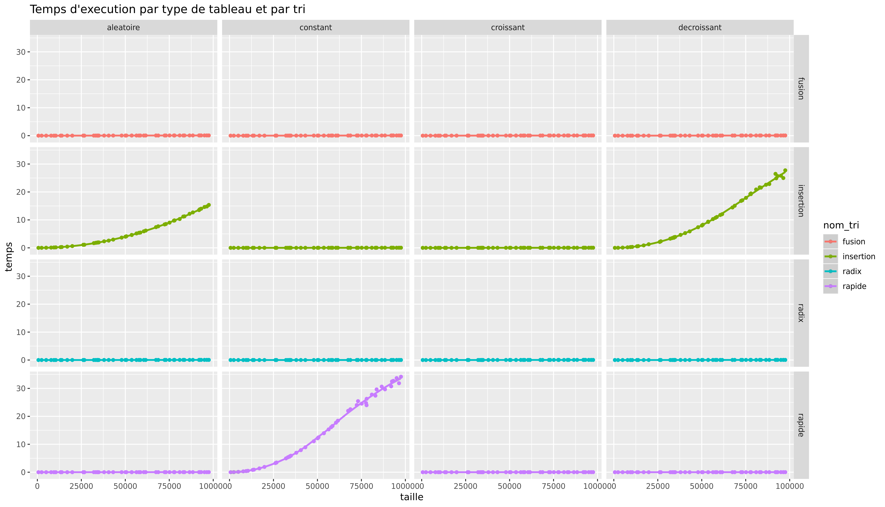 | 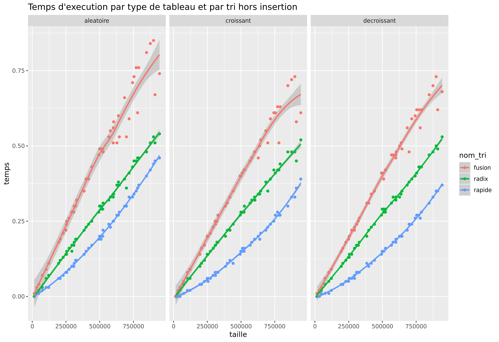 |

### Consommation mémoire

Voici deux graphiques permettant de comparer la consommation mémoire de nos 4 algorithmes selon les différents types de tableaux à l'aide d'une même échelle. Le 2e a été réalisé sans les tableaux constants car il explose pour le tri rapide, ainsi on peut mieux voir les 3 autres types de tableaux.

| Tout les algorithmes de tris | Sans les tableaux constants |
|------------------------------|-----------------------------|
| 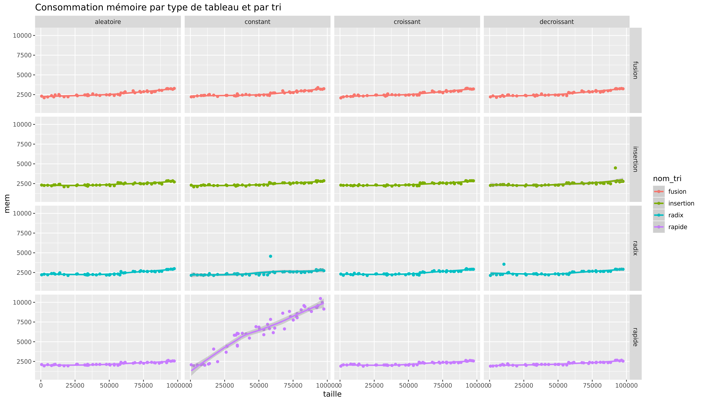 | 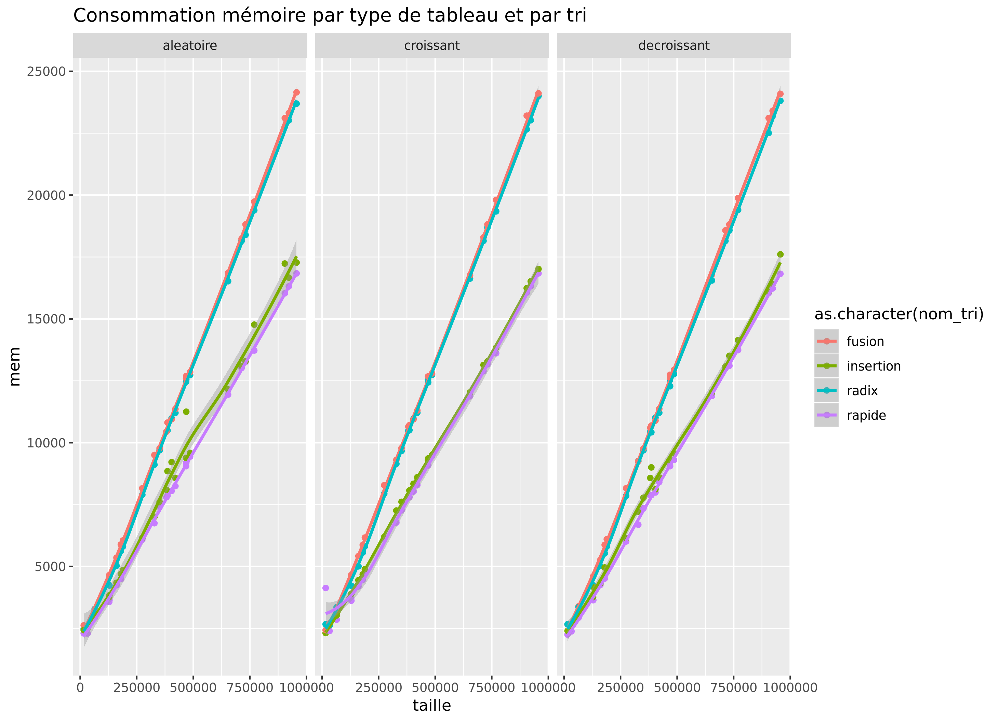 |


### Analyse des résultats préalables
 
- Tri insertion :

    Niveau temps d'exécution, le tri par insertion va être le plus rapide pour trier un tableau trié. Il va consommer seulement le temps de vérifier chaques éléments 2 à 2. Autrement, sur d'autres tableaux comme aléatoire ou décroissant, il va prendre beaucoup de temps, car si un élément est mal placé il va le déplacer cran par cran. De plus, le tri insertion est aussi très efficace pour les tableaux constants (ne contenant qu'une seule et même valeur dans toutes les cases), puisque ce type de tableau est un cas particulier des tableaux triés.

    Niveau mémoire, le tri insertion reste très optimisé. De par son fonctionnement, il exécute le tri directement dans le tableau donné en entrée. Ainsi, il consommera la mémoire de manière linéaire et en petite quantité par rapport aux autres tris.


- Tri fusion :

    Ce tri a un temps d'exécution uniforme entre tous les types de tableaux. Il est plutôt efficace par rapport au tri par insertion, sauf avec un tableau croissant où il est beaucoup moins rapide (10x plus long).

    Cette version n'est pas encore très optimisé niveau mémoire, car c'est le plus gourmand de tous avec le radixSort. Il utilise 13x plus de mémoire que le tri par insertion et 1.3x plus que le tri rapide.


- Tri Rapide :  
    
    Le tri rapide est le tri le plus efficace au niveau temps d'exécution pour les tableaux aléatoires et décroissants. Il est aussi particulièrement efficace sur des tableaux croissants, en effet c'est dans ce cas-ci que nous avons obtenu les meilleurs résultats. Cependant, même si le tableau constant est un cas particulier ce celui trié, il s'agit du pire cas pour le tri rapide.
    
    Au niveau de la consommation mémoire celle-ci reste relativement constante, toutefois celle-ci explose quand on veut traiter un tableau constant.


-  Tri Radix :

    Le tri radix est assez efficace puisque son temps d'exécution se rapproche fortement du tri fusion. Toutefois, on note qu'il semble être un peu plus lent pour les tableaux aléatoires comparer aux croissants/décroissants. Le pire des cas étant pour lui les tableaux constants. Cependant, une amélioration simple pour y pallier est décrite dans la section "Discussion des résultats".

    Sa consommation est elle aussi constante quel que soit le tableau passé en paramètre. En effet, dans le code on utilise un unique malloc faisant exactement la taille du tableau à trier. Les autres tableaux utilisés faisant tous 10 cases de la taille d'un long, leur utilisation est négligeable.


### Discussion des résultats préalables
 
- Tri insertion :

    Pour ce qui est de la complexité de l'algorithme de tri insertion, voici ce que l'on obtient :

    Dans le pire des cas (tableau décroissant):
        3(n-1) + 1/2 * (n-1)(n-2) + 2 = O(n²)
    
    Dans le meilleur des cas (tableau croissant):
        3(n-1) + 2(n-1) = 5(n-1) = O(n)

    Niveau amélioration on peut améliorer ce tri en regardant directement où il doit placer la nouvelle valeur d'indice i avec un parcours pour ensuite faire le décalage plutôt que de la déplacer cran par cran en remplaçant les valeurs à chaque fois jusqu'à ce qu'on ne puisse plus.

    Le tri insertion étant particulièrement efficace pour les tableaux presque triés, mais très lent pour le reste, il serait possible de l'utiliser en complément d'un autre tri. Ce tri ferait la première partie du travail et on lancerait ensuite le tri insertion pour optimiser le temps d'exécution de la fin de l'algorithme.

- Tri fusion :

    Le tri fusion a 2 différents défauts. Tout d'abord, le tri d'un tableau aléatoire ou constant sera ~16% plus long que sur des tableaux croissants et décroissants. Ensuite, ce tri est pour le moment très gourmand en mémoire. En effet, pour chaque subdivision il va créer un nouveau tableau et donc utiliser 2 tableaux qui font chacun la moitié du tableau de la subdivision précédente.
    
    Pour résoudre le problème de la mémoire on peut implémenter la solution suivante: Au lieu de recréer un tableau à chaque subdivision on pourrait juste recréer un seul tableau de la même taille que le tableau à trier et trier les données de l'un vers l'autre à chaque subdivision. Ainsi, on utiliserait seulement le double de mémoire que la taille tableau.

    Pour la complexité du tri fusion, on fait 2 appels récursifs à sousTriFusion avec à chaque fois une taille environ égale à n/2. Ainsi, on a=2 et b=2. Puis, dans fusion on effectue 4n opérations ce qui correspond à un ordre de grandeur de n¹ donc c=1.
    2(n/2) + O(n¹) = O(n log(n))

- Tri Rapide :

    Le tri rapide a différents defauts qui se révèlent surtout lors du tri de tableau croissant, décroissant et constant. En effet, le pivot étant toujours la dernière valeur du tableau, si notre tableau est déjà trié, alors l'algorithme va passer en revue tout le tableau et chaque appel récursif se fera sur un tableau de taille_k+1 égale à taille_k - 1. Le tri rapide est alors extrêmement lent sur ces cas de figure.

    Pour résoudre ce problème plusieurs choix s'offrent à nous. Mélanger le tableau passé en paramètre pour toujours effectuer le tri sur un aléatoire, choisir le pivot aléatoirement, prendre la médiane pour pivot... Nous avons choisi d'implémenter un pivot aléatoire ce qui a grandement optimisé notre algorithme.

    Le pire cas que peut rencontrer le tri rapide est donc le tableau constant qui lui fait atteindre une complexité de O(n²).

- Tri Radix :

    Le tri radix n'est à la base pas prévu pour des tableaux prenant des valeurs négatives en compte. En effet, le tri radix à l'effet inverse sur les valeurs négatives puisqu'il va les trier dans l'ordre décroissant. Le résultat dans le cas d'un tableau mêlant valeurs négatives et positives n'est alors trié dans aucun des deux ordres.
    
    La première solution à laquelle nous avons pensé était de séparer le tableau en deux afin de trier les valeurs positives d'une part et les négatives de l'autre. Il s'agissait soit, d'inverser l'ordre de la partie négative à sa sortie, soit de modifier l'algo pour lui donner l'effet inverse. Enfin on aurait mis les deux parties bout à bout. Cependant, cette méthode semblait être gourmande en temps et en mémoire, c'est pourquoi nous avons appliqué autre chose.

    La solution privilégiée fut d'étendre notre tableau gérant l'histogramme des valeurs à des chiffres négatifs. Ainsi au niveau consommation mémoire on utilise seulement 10 longs en plus et il n'est pas nécessaire de séparer ou inverser notre tableau ce qui est beaucoup moins gourmand en temps.

    Enfin, le pire des cas pour le tri radix est le tableau constant. Cependant, ce dernier cas peut facilement être amélioré. En effet, au début de l'algorithme on cherche le minimum et le maximum du tableau pour connaitre le nombre de boucle à effectuer. Il suffit de comparer les deux et si les valeurs sont les mêmes c'est que le tableau est constant et donc déjà trié.

## Etude approfondie

### Hypothèse

Les tableaux qui possèdent une partie d'un certain type (croissant, décroissant, constant, aléatoire) et une deuxième d'un autre type sont optimisés pour le tri fusion car il utilise une partition. Comme d'autres tris sont plus performant que le tri fusion pour certains types de tableaux, on émet l'hypothèse qu'ils le seront aussi lors d'un mélange de type. Ce mélange pourrait être hétérogène, c'est-à-dire, un type de tableau différent dans chaque partie, ou homogène, le même type dans les deux sous-parties mais qui au global ne correspond pas à un tableau de ce type (par exemple deux sous parties triés mais indépendantes).

### Protocole expérimental de vérification de l'hypothèse

Nous allons nous concentrer sur les types de tableaux et tris qui nous ont donnés les meilleurs résultats lors de la phase une pour crées les données et les tris que nous mettrons en concurrences avec le tri fusion.

- Tri insertion :  

    Le tri insertion est extrêmement efficace pour les tableaux croissants et constants mais vraiement très lent pour le reste. Ainsi on le testeras sur des tableaux suivants :

    - deux sous-parties croissantes
    - deux sous-parties constantes
    - partie croissante + partie constante

&nbsp;
- Tri rapide :  

    Le tri rapide est plus rapide que le tri fusion pour les tableaux aléatoires, croissants et décroissants.
    Ainsi on le testeras sur des tableaux suivants :
    - deux sous-parties croissantes
    - deux sous-parties décroissantes
    - partie croissante + partie décroissante
    - partie croissante + partie aléatoire
    - partie décroissante + partie aléatoire
  
&nbsp;
- Tri radix :  

    Le tri radix a un temps d'exécution assez proche du fusion pour tous les type de tableau et il est plus rapide pour les constants. Cependant l'amélioration effectuée pour les tableaux constants ne va pas fonctionner pour les mélanges de types car elle se base de la comparaison du plus grand et du plus petit élément du tableau. On peut donc éliminer ce type qui nous donneras forcément des résultats moins bons que ceux du fusion.
    Ainsi on le testera sur des tableaux suivants :
    - deux sous-parties croissantes
    - deux sous-parties décroissantes
    - partie croissante + partie décroissante
    - partie croissante + partie aléatoire
    - partie décroissante + partie aléatoire
  
  
Notre procédure d'exécution reste sensiblement la même qu'auparavant.  
En premier lieu vient l'exécution de perf2.sh avec la ligne suivante :

```
./perf2.sh <nbRepetition> <tailleMaxTableau> <minVal> <maxVal> <premierType> <deuxiemeType> >> <nom_du_fichier>
```

Les paramètres que nous utilisons sont toujours les mêmes et ont été définis comme suit :  
Nombre de tests : 30  
Taille maximale des tableaux : 1 000 000  
Valeur minimale : -10 000  
Valeur maximale : 10 000  

On retrouvera des données dans le fichier créé de la manière suivante :

````$xslt
iTest  taille min    max    nom_tri    type_tab   indexChange    premierType    deuximeType    temps  mem
1  222813 -10000 10000  f  m  15263  c  a  0.12   4856
1  222813 -10000 10000  r  m  15263  c  a  0.07   3320
1  222813 -10000 10000  x  m  15263  c  a  0.09   4740
2  514531 -10000 10000  f  m  371204 c  a  0.23   9404
2  514531 -10000 10000  r  m  371204 c  a  0.14   5628
2  514531 -10000 10000  x  m  371204 c  a  0.18   9388
3  616549 -10000 10000  f  m  82911  c  a  0.32   10940
...
````

Une fois les données vérifié, on lance R et on tape les commande suivante :

````$xslt
library(ggplot2)
````
(import d'une librairie pour de plus beau graphique)

````$xslt
perf <- read.table("nom_du_fichier", header = TRUE)
````
(import des données)

````$xslt
ggplot(perf,aes(x=taille, y=temps, group=nom_tri, colour=nom_tri)) + geom_point() + geom_smooth() + ggtitle("titre du tableau")
````
(créer un graphique à partir des données importé avec une courbe par tri)

````$xslt
ggsave("nom_du_tableau.png")
````
(créer une image a partir du graphique)  


### Résultats expérimentaux

| Jeu de test                                | Temps d'execution par tris       |
|--------------------------------------------|----------------------------------|
| deux sous-parties croissantes              | 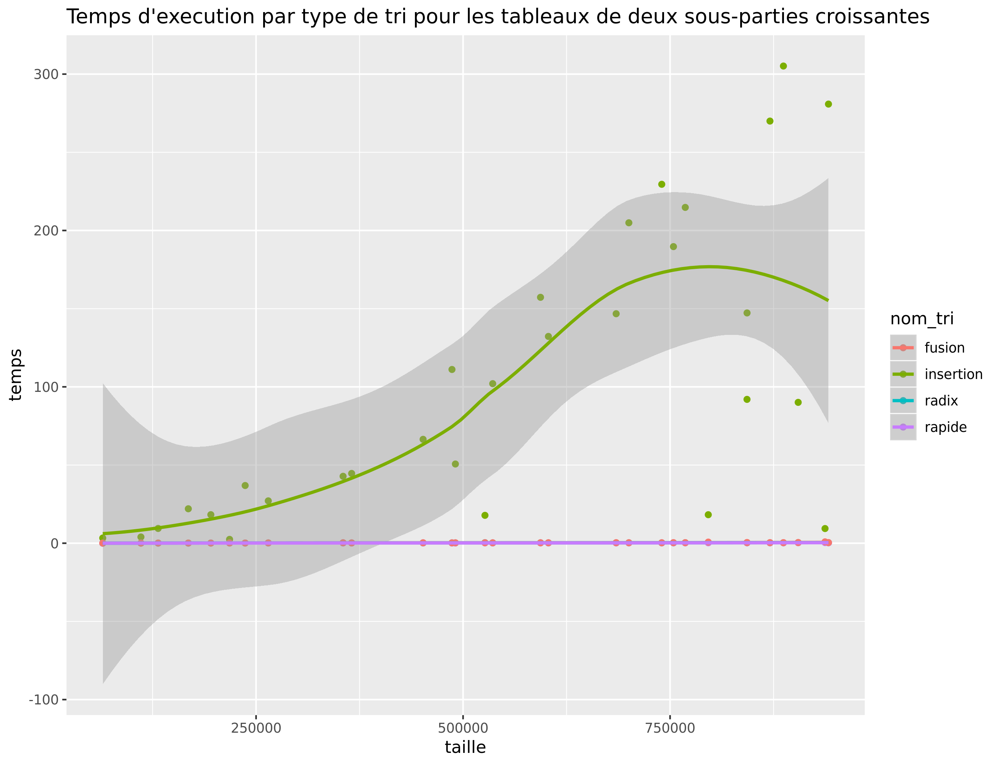 |
| deux sous-parties décroissantes            | 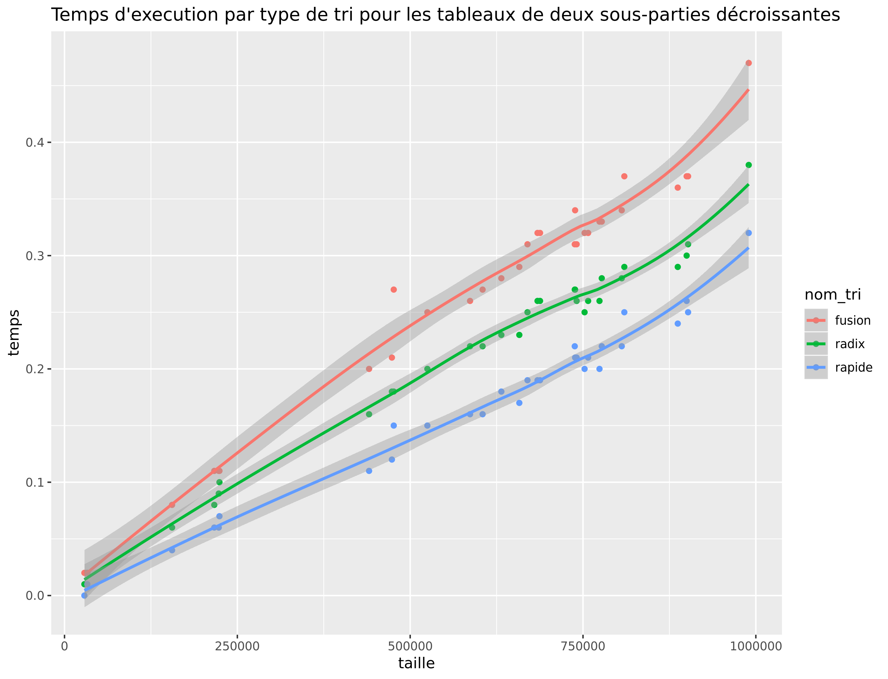 |
| deux sous-parties constantes               | 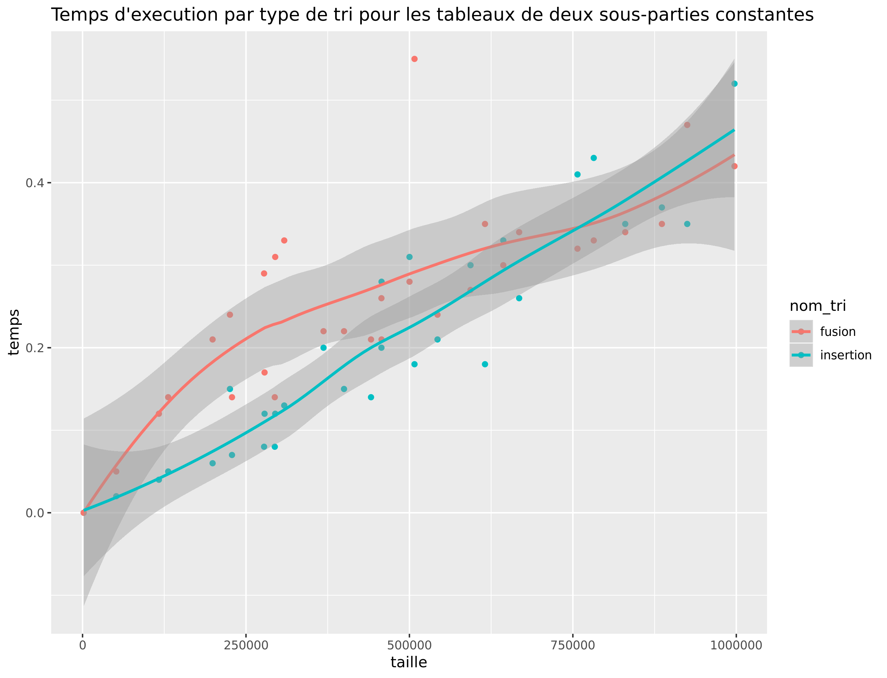 |
| partie croissante + partie décroissante    | 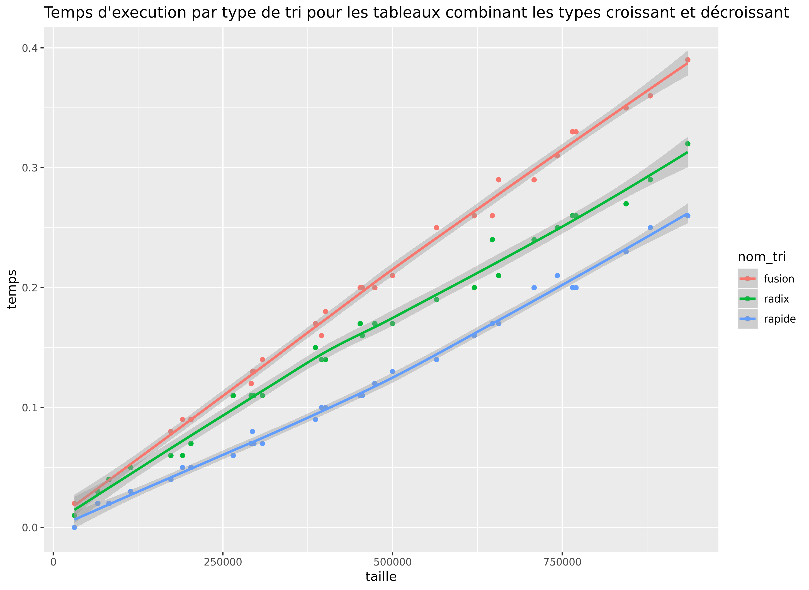 |
| partie croissante + partie aléatoire       | 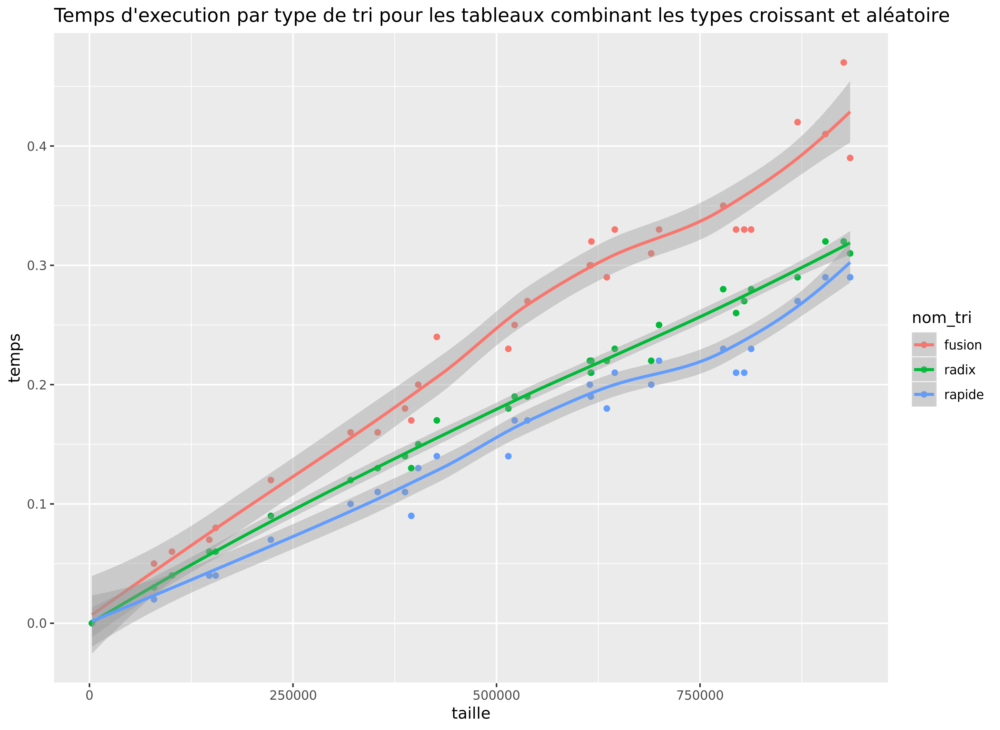 |
| partie décroissante + partie aléatoire     | 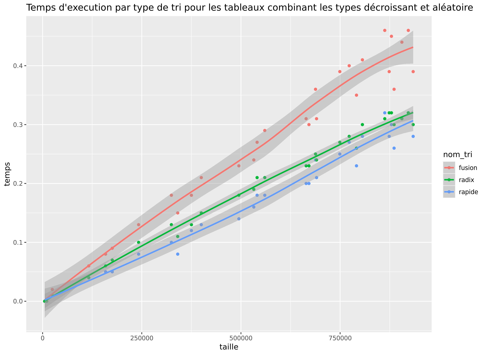 |
| partie croissante + partie constante       | 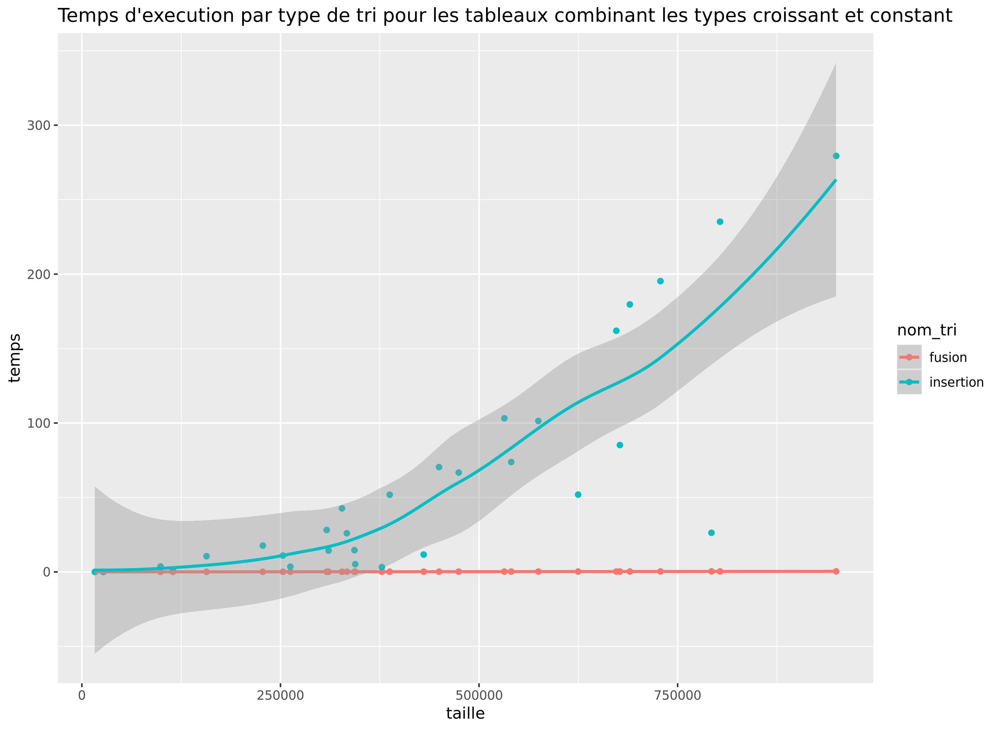 |

### Analyse des résultats expérimentaux

- Mélanges hétérogènes :

    On observe sur nos différents graphiques que le tri fusion qui se trouve être la courbe en rouge prends toujours plus de temps lors de son exécution que les tris radix et rapide. Cependant, dans le cas d'un mélange croissant / constant, le tri fusion est alors bien plus rapide que le tri insertion.

    Ainsi, même si le tri fusion semblait être mieux adapté aux tableaux mélangeant deux types de par sa technique de partition, il s'avère que les tris rapides et radix sont plus optimisés dans les cas sans partie constante.
  

- Mélanges homogènes :

    On observe sur le graphique du double tableau décroissant que l'ordre de temps d'exécution est toujours conservé; du plus lent au plus rapide : fusion-radix-rapide. De plus, sur le tri d'un double tableau croissant, le tri par insertion se comporte beaucoup moins bien que sur un tableau totalement trié. Lors du tri d'un double tableau constant fusion semble bien rivaliser avec le tri par insertion et même légèrement prendre le dessus.
    
    On peut aussi constater que pour le tri d'un tableau double croissant les courbes des tri fusion-radix et rapide se superpose.
    
    Ainsi, comme nous l'avions conjecturé pour un double tableau constant le tri fusion semble prendre le dessus quand la taille augmente. Cependant la situation pour le double croissant et décroissant reste inchangé.

### Discussion des résultats expérimentaux

- Mélanges hétérogènes :

    La différence de temps d'exécution du tri fusion est très faible par rapport à celui des deux autres. Cela pourrait s'expliquer notamment par le fait que les partitions de tri fusion prennent du temps en termes de copie des valeurs dans les nouveaux tableaux, en effet il fait beaucoup plus d'accès mémoire que les autres algorithmes.
  

- Mélanges homogènes :

    On peut remarquer un accroissement général de l'instabilité dès l'algorithmes. En effet on peut remarquer que le tri par insertion sur un double tableau constant de 1 000 000 peut prendre 10 secondes comme 300. Cela peut surement provenir du fait que la séparation des deux "partie" du tableau est aléatoire.

## Conclusion et travaux futurs

En conclusion, on constate que notre hypothèse a pu être validée pour certains mélanges. En effet, l'algorithme du tri fusion offre effectivement de moins bonnes performances que les autres dans les cas suivants : deux sous-parties décroissantes, partie croissante + partie décroissante, partie croissante + partie aléatoire, partie décroissante + partie aléatoire.

Les tests que nous avons fait dans le cadre de notre hypothèse pourraient être améliorés dans des travaux futurs. En effet, il reste de nombreuses choses que nous n'avons pas eu le temps de traiter. Voici donc 4 pistes d'améliorations que nous avons identifiées.

- Pour chaque jeu de test il serait pertinent de comparer l'influence de la position de séparation entre les deux sous-parties du tableau en la faisant varier à l'aide de nombreux tests et en comparant sur des graphiques.

- De même, on pourrait étudier si l'ordre de nos sous-parties influent le temps d'exécution. On doublerait alors notre jeu de tests pour faire la distinction entre la première et la deuxième partie en inversant les types.

- La consommation mémoire de nos tris est une donnée que nous n'avons pas eu le temps d'aborder dans notre étude approfondie mais elle y a autant sa place que le temps d'exécution sur lequel nous nous sommes concentré.

- Enfin, il serait aussi possible d'étudier le cas de tableaux composés de plus de 2 sous-parties.